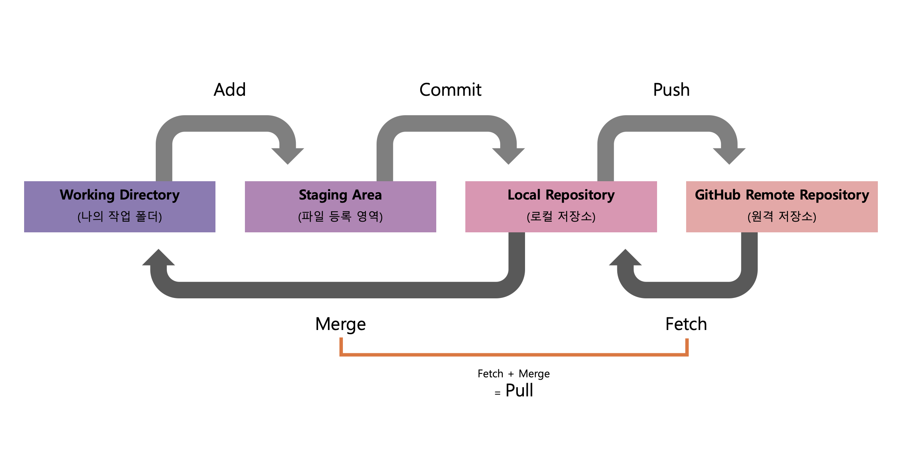

# 🎁 Git & GitHub 이해하기

## Git
Git 이란 <mark>버전 관리 시스템(VCS)</mark> 중 하나로, 프로젝트의 소스 코드나 파일들의 변경 이력을 관리하고 추적하는 도구이다. 
작동방식은 스냅샷 방식으로 여러 명의 개발자가 동시에 작업할 수 있고, 변경 사항 추적과 관리할 수 있다. 이를 통해 프로젝트의 버전을 관리하고, 이전 상태로 손쉽게 복구하거나 변경 사항을 비교할 수 있다.
위쪽의 작동 구조 이미지를 보면 쉽게 이해할 수 있다.
내 컴퓨터 : `Working Directory`, `Staging Area`, `local Repositoy`
원격 : `Remote Repository`

## GitHub
GitHub는 Git을 기반으로한 <mark>웹 기반의 호스팅 서비스</mark>로, Git 저장소를 호스팅하고 버전 관리를 위한 다양한 기능을 제공한다. GitHub를 사용하면 개발자들은 프로젝트를 협업하고 관리할 수 있으며, 소스 코드를 온라인 상에서 공유하고 협업할 수 있다.

 

## GitHub 용어
### Repository
스테이지에서 대기하고 있던 파일들을 버전으로 만들어 저장하는 곳이다.
Gi은 원격(remote) 저장소와 로컬(local) 저장소, 두 종류의 저장소를 제공한다.

### Remote Repositry(원격 저장소)
